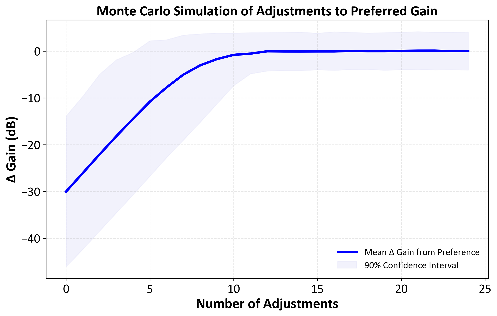

# Hearing aid gain adjustment  Monte Carlo simulation

## Overview
Python script for simulating how users adjust hearing aid gain to reach their preferred gain settings. The simulation models the adjustments users make over time, starting from an initial reference gain. Monte Carlo simulations introduce variability in user preferences and adjustment patterns to study the overall distribution and trends in user gain adjustments.

## Features
- **Simulated adjustments**: Models user self-adjustments of hearing aid gain over multiple sessions.
- **Monte Carlo simulation**: Simulates multiple user trials with varied preferences, enabling an understanding of how different users adjust their gain.
- **Adjustable parameters**: Customise the number of adjustments, the mean adjustment size, and variability in both user adjustments and preferred gain settings.
- **Visualisation**: Plots the mean and confidence intervals for gain adjustments, as well as changes from preferred gain over time.
