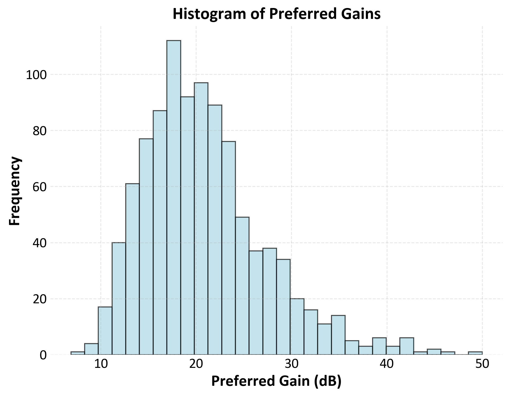
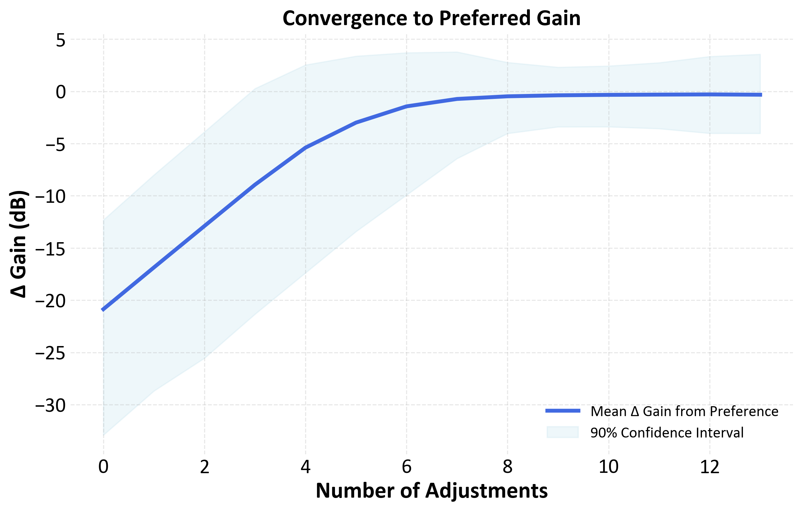

# Hearing aid gain adjustment  Monte Carlo simulation

Python script for simulating how users adjust hearing aid gain to reach their preferred gain settings. The simulation models the adjustments users make over time, starting from an initial reference gain. Monte Carlo simulations introduce variability in user preferences and adjustment patterns to study the overall distribution and trends in user gain adjustments. User preferences for gain are modelled using a log-normal distribution to reflect the skewed nature of real-world preferences, while adjustments made during simulations are modelled using a normal distribution.

- **Simulated adjustments**: Models user-driven adjustments of hearing aid gain over multiple trials, starting from an initial reference gain of 0 dB. Adjustments are modelled using a normal distribution. Adjustment size is reduced as users approach their preferred gain, simulating the tendency to make finer adjustments when nearing the desired setting.
- **Monte Carlo simulation**: Simulates multiple user trials with varied preferences, enabling an understanding of how different users adjust their gain. User gain preferences are modelled using a log-normal distribution to reflect the nature of real-world hearing aid preferences (considering that mild to moderate hearing losses are most common). 
- **Adjustable parameters**: The number of adjustments, the mean adjustment size, and variability in both user adjustments and preferred gain settings.
- **Visualisation**: Plots the mean and confidence intervals for gain adjustments.

  
  

